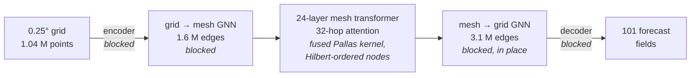

<div align="center">

# faster-weathernext

**Google DeepMind's WeatherNext 2 at full 0.25° resolution — on the GPU you already have.**

Same model · same checkpoints · same results · **6.4 GiB instead of 34 GiB** · **7× faster**

[](LICENSE)
[](pyproject.toml)
[](pyproject.toml)
[](#hardware)
[](docs/validation.md)


<sub>A September 2026 US nor'easter, forecast 78 hours ahead. <b>Left and middle: the same WeatherNext 2 checkpoint and noise seed</b> — the reference implementation needs 20.8 GiB and 5.5 s per 6-hour step; faster-weathernext needs 3.8 GiB and 0.78 s. Right: what actually happened (ECMWF analysis). RTX 5090.</sub>

</div>

> [!NOTE]
> Unofficial community project — not affiliated with or endorsed by Google or Google DeepMind.
> WeatherNext is an experimental research model; it does not replace official forecasts or warnings.

## Why

[WeatherNext 2](https://github.com/google-deepmind/weathernext) is Google DeepMind's probabilistic global weather model ([Alet et al., 2025](https://arxiv.org/abs/2506.10772)): it forecasts the whole atmosphere at 0.25° (~28 km) in 6-hour steps, and every call draws a new, physically consistent ensemble member. The weights are open — but the official code targets TPUs, and its GPU path needs **~34 GiB for a single step**, i.e. an 80 GB data-center card.

**faster-weathernext** patches the official code at run time so the *same* model runs on a gaming GPU. Nothing is approximated: no quantization, no distillation, no sparse or low-rank attention. The model computes exactly the same function; only *how* it is executed changes.

<picture>
  <source media="(prefers-color-scheme: dark)" srcset="docs/figures/perf_dark.svg">
  
</picture>

- **Exact.** Matches the official GPU implementation to floating-point rounding (fp32: correlation 0.9999999998 across all 101 output fields).
- **Small.** Full 0.25° resolution in ~6.4 GiB — **runs on 8 GB cards** like the RTX 4060.
- **Fast.** 0.78 s per 6-hour step on an RTX 5090: **a 10-day forecast in ~31 seconds** per ensemble member.
- **Drop-in.** One call — `faster_weathernext.enable()` — then use the official code and checkpoints unchanged.
- **Batteries included.** `fwn forecast` pulls initial conditions from ECMWF open data and writes NetCDF.

## Quick start

```bash
pip install "faster-weathernext[cuda12,weathernext] @ git+https://github.com/Raymondlol/Faster-WeatherNext.git@v0.1.1"
```
<sub>Python 3.12. Use `[cuda13]` with a CUDA 13 driver. The `[weathernext]` extra installs the official code at the validated commit; leave it out if `weathernext` is already installed (e.g. with earth2studio). Weights (~735 MB per checkpoint) come from Google's public bucket, initial conditions from ECMWF open data on AWS; both are cached in `~/.cache/faster-weathernext`.</sub>

```bash
fwn info        # your GPU, memory, attention path, compatibility check

# 10-day ensemble (4 checkpoints × 2 noise samples) from today's 00 UTC analysis, over North America
fwn forecast --init 2026092800 --steps 40 --checkpoints 1 2 3 4 --samples 2 \
    --region 15 60 230 310 --out forecast.nc
```

Already using the official code? Add one line before the model is built:

```python
import faster_weathernext
faster_weathernext.enable()

# ...continue exactly as in google-deepmind/weathernext's demo notebook.
```

Or use the helpers:

```python
import datetime as dt
import jax
import faster_weathernext
from faster_weathernext import ifs, model

faster_weathernext.enable()
task, forward = model.build("WeatherNext2")
params = model.load_params("WeatherNext2", checkpoint=1)
inputs, targets, forcings = ifs.rollout_inputs(dt.datetime(2026, 9, 28, 0), n_steps=40, task=task)

for step, pred in enumerate(model.rollout(forward, params, jax.random.PRNGKey(0), inputs, targets, forcings)):
    print(f"+{6 * (step + 1)} h", float(pred["mean_sea_level_pressure"].min()) / 100, "hPa")
```

## Hardware

| GPU | VRAM | time per 6-h step | 10-day forecast (one member) |
|---|---|---|---|
| RTX 5090 | 32 GB | 0.78 s | 31 s |
| A100 | 40 GB | 1.1 s | 44 s |
| A10G | 24 GB | 2.5 s | 1.7 min |
| L4 | 24 GB | 3.5 s | 2.3 min |
| RTX 4060 | 8 GB | 5.2 s ¹ | 3.5 min |
| T4 | 16 GB | 44 s ² | 29 min |

<sub>Default (TF32) precision, measured during rollouts; see [validation](docs/validation.md). The first step adds ~1 minute of compilation.
¹ Needs `XLA_PYTHON_CLIENT_MEM_FRACTION=0.9` (the CLI sets it); whole-card peak 7.3 of 8.0 GB.
² Turing GPUs have no TF32: the XLA attention path in full fp32 is used automatically.
Tested on NVIDIA GPUs. Other devices (e.g. AMD ROCm) fall back to the XLA attention path, untested.</sub>

## Is it really the same model?

Yes — and we checked it harder than "the numbers look close".

**One step, same inputs and noise, all 101 output fields**, against the reference implementation (the official modules; itself matched to the official GPU path at the same level on an A100-80GB):

| matmul precision | min. correlation | max. relative RMS difference |
|---|---|---|
| fp32 (`highest`) | 0.9999999998 | 2.0 × 10⁻⁵ |
| TF32 (default on GPUs) | 0.99999 | 4.8 × 10⁻³ — the same size as TF32's own rounding |

**Real forecasts.** We re-ran nor'easter hindcasts from four start times with all four WeatherNext 2 checkpoints and the same noise seeds. In a chaotic atmosphere any rounding difference grows over time — but it stays far below the forecast's own uncertainty (the spread between ensemble members), and forecast skill against ECMWF analyses is unchanged (within 0.8 %, while two halves of the same ensemble typically differ by 2.5 %).

**Also checked:** the Mini model and batch size 2 against the official GPU path (fp32: max relative RMS difference 5.7 × 10⁻⁵), and stock vs patched inside NVIDIA earth2studio's wrapper (2.4 × 10⁻⁵).

<picture>
  <source media="(prefers-color-scheme: dark)" srcset="docs/figures/chaos_dark.svg">
  
</picture>

Every number above links to raw logs and scripts in [docs/validation.md](docs/validation.md) — including the official-path comparison on an A100-80GB, and cross-checks on A100, A10G, L4, T4 and RTX 4060.

## How it works

The model's math is untouched; `enable()` swaps a few classes in the official modules for subclasses that execute the same computation with far less memory traffic:



1. **Fused masked attention.** A Pallas (Triton) flash-attention kernel for the model's 32-hop icosahedral-mesh mask. It walks only the 64×32 tiles that contain a valid key and never writes the attention matrix to memory. Mesh nodes are processed along a 3D Hilbert curve, halving the tiles to visit.
2. **Blocked graph networks.** The official code materialises per-edge tensors for 3.1 million edges (8.9 GiB each). Here edges and grid points are processed in blocks, with in-place updates.
3. **No wasted memory.** Blocked encoder and decoder, the 24 transformer layers as a loop (one layer's buffers instead of a fragmented heap), and a single shared copy of the attention mask.

Details and measurements: [docs/how-it-works.md](docs/how-it-works.md).

## FAQ

<details>
<summary><b>Is this quantized, pruned or approximated in any way?</b></summary>

No. Weights are the official fp32 checkpoints, attention is exact, and every layer computes the same function. Results differ from the official code only by floating-point rounding (different summation order), at the level shown above.
</details>

<details>
<summary><b>Why aren't results bit-identical between runs?</b></summary>

XLA picks GPU kernels by timing them, so kernel choices — and the last bits of the result — vary between runs, with or without this project. Use `fwn forecast --autotune-cache kernels.txt` to save the choices on the first run and reuse them. For strict fp32, use `--precision highest --no-autotune`.
</details>

<details>
<summary><b>My GPU has 8 GB. Anything to know?</b></summary>

JAX reserves 75 % of GPU memory by default, which is too little on an 8 GB card. Set `XLA_PYTHON_CLIENT_MEM_FRACTION=0.9` (the `fwn` CLI does this unless you set it), and avoid driving a display from the same GPU if possible.
</details>

<details>
<summary><b>AMD, Intel or Apple GPUs?</b></summary>

NVIDIA; Intel Arc B580 runs the XLA attention path (contributed). On AMD ROCm and Intel XPUs, the XLA chunked attention path is selected automatically; Intel GPUs run via Intel's OpenXLA PJRT plugin (`jax-oneapi-plugin`), see [docs/validation.md](docs/validation.md#7-intel-xpu--arc-gpus-openxla-via-oneapi). The 1° Mini model runs end-to-end (1.1 s/step); a full 0.25° step is constrained by OpenXLA rematerialization under 12 GB and is currently a TODO. Apple GPUs lack a maintained JAX backend.
</details>

<details>
<summary><b>How does this relate to other ports?</b></summary>

[NVIDIA earth2studio](https://github.com/NVIDIA/earth2studio) wraps WeatherNext 2 with the official GPU attention (80 GB GPUs). [kashif/weathernext2](https://huggingface.co/kashif/weathernext2) ports it to PyTorch / 🤗 `transformers`; its model card states ~50 GB per ensemble member at 0.25°. faster-weathernext keeps the official JAX code and changes only how it runs.
</details>

<details>
<summary><b>Can I use it with earth2studio?</b></summary>

Yes. Install `faster-weathernext` (without the `[weathernext]` extra) into the earth2studio environment and call `faster_weathernext.enable()` before `WeatherNext2Cyclones.load_model(...)`; the wrapper's own jitted forward then runs through the patched modules. Checked against the unpatched wrapper on the Mini model, and at 0.25° on a 32 GB GPU: [docs/validation.md](docs/validation.md#6-inside-earth2studio).
</details>

<details>
<summary><b>Can I train or fine-tune with this?</b></summary>

Not yet — the fused kernel and blocked graph networks implement the forward pass only.
</details>

## Citation and licenses

faster-weathernext is Apache-2.0 ([LICENSE](LICENSE), [NOTICE](NOTICE)). It downloads — but does not redistribute — the WeatherNext weights (© Google, [CC BY 4.0](https://creativecommons.org/licenses/by/4.0/)) and ECMWF open data (© ECMWF, CC BY 4.0). If you use WeatherNext 2, please cite the model:

```bibtex
@article{alet2025skillful,
  title   = {Skillful joint probabilistic weather forecasting from marginals},
  author  = {Alet, Ferran and Price, Ilan and El-Kadi, Andrew and Masters, Dominic and Markou, Stratis and
             Andersson, Tom R and Stott, Jacklynn and Lam, Remi and Willson, Matthew and
             Sanchez-Gonzalez, Alvaro and Battaglia, Peter},
  journal = {arXiv preprint arXiv:2506.10772},
  year    = {2025}
}
```
